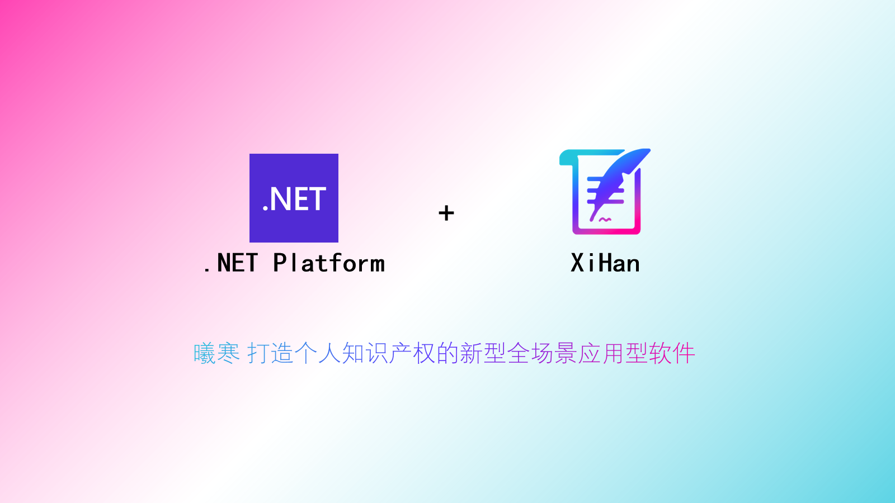

 

        

这是基于DotNet7的打造个人知识产权的新型全场景应用型软件项目。

高效快速 返哺开源 用心创作 探索未知

## 快速开始

官方文档：[曦寒官方文档](https://docs.xihan.fun)

在线体验：[曦寒接口文档（后端仅只）](https://api.xihan.fun)

## 所用框架

- DotNet7(CSharp);
- WebApi;

### 框架模块：

- [x] 采用`仓储+服务+接口`的形式封装框架；

- [x] 全面异步 async/await 开发；

- [x] 国产数据库 ORM 组件 SqlSugar ；

- [x] 支持自由切换多种数据库，MySql/SqlServer/Sqlite/Oracle/Postgresql/达梦/人大金仓；

- [x] 项目启动，支持自动生成种子数据；

- [ ] 五种日志记录，审计/异常/请求响应/服务操作/Sql记录等；

- [x] 搭配全套前端项目：

  - 后端：XiHan.Framework；

  - 前端：XiHan.Manage（后台管理）、XiHan.Display（前台展示）；

  - 文档：XiHan.Docs

- [ ] 统一集成 IdentityServer4 认证 ✨;

### 组件模块：

- [x] 提供 Redis 做缓存处理；
- [x] 使用 Swagger 做API文档；
- [x] 使用 MiniProfiler 做接口性能分析 ✨；
- [x] 使用 Automapper 处理对象映射；
- [x] 使用自带高性能依赖注入容器，并提供批量服务注入 ✨；
- [x] 支持 CORS 跨域；
- [x] 封装 JWT 自定义策略授权；
- [x] 使用 Serilog日志框架，高性能日志记录；
- [ ] 使用 SignalR 双工通讯 ✨；
- [ ] 添加 IpRateLimiting 做 API 限流处理;
- [ ] 使用 Quartz 做任务调度;
- [x] 支持 数据库`读写分离`和多库操作 ✨;
- [ ] 新增 Redis 消息队列 ✨;
- [ ] 新增 RabbitMQ 消息队列 ✨;
- [ ] 新增 EventBus 事件总线 ✨;
- [ ] 新增 ES 搜索配置;

### 微服务模块：

- [x] 可配合 Docker 实现容器化；
- [x] 可配合 Nginx 实现负载均衡；
- [ ] 可配合 Ids4 实现认证中心；

## 项目相关

贡献代码：[贡献代码](CONTRIBUTING.md)

更新沿程：[更新沿程](CHANGELOG.md)

启动：

```
dotnet /home/web/zhaifanhua.com/blog/XiHan.WebApi.dll --environment=Production --urls=http://*:9708 --ip=127.0.0.1
```


## Status


## Star History


